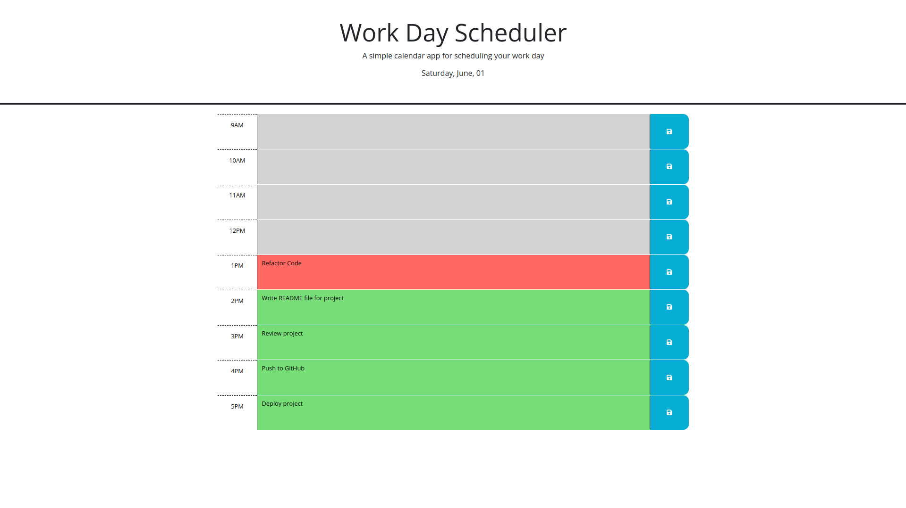
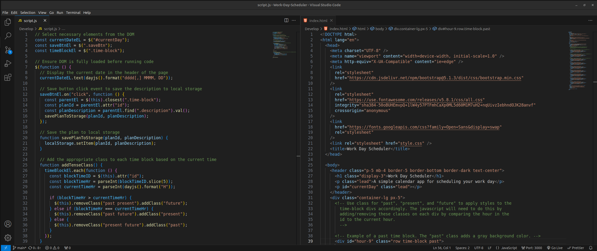

# 05 Third-Party APIs: Work Day Scheduler

## Project Overview

The goal of this project is to create a simple calendar application by modifying starter code. This application allows users to save events for each hour of a typical working day (9am–5pm). It runs in the browser and features dynamically updated HTML and CSS powered by jQuery.

## Live Demo

To access the live website, <a href="https://a-mohamed14.github.io/Work-day-scheduler/">click here</a>

## Key Features And Accomplishments

- **Current Day Display:** When the planner is opened, the current day is displayed at the top of the calendar.

- **Standard Business Hours:** The planner includes timeblocks for the standard business hours of 9am to 5pm, ensuring all work hours are covered.

- **Colour Coded Timeblocks:** Each timeblock is color-coded to visually indicate whether it is in the past (grey), present (red), or future (green), providing a clear and immediate understanding of the schedule.

- **Event Entry:** Users can easily click into any timeblock to enter an event, making scheduling quick and intuitive.

- **Event Saving:** A save button within each timeblock allows users to save their events. The event text is stored in local storage, ensuring data is not lost.

- **Persistence:** Saved events persist even when the page is refreshed, thanks to the integration with local storage, allowing users to maintain their schedule without re-entering data.

## Website Preview

## Code Preview

